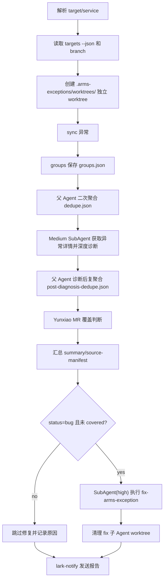

# ARMS 异常分诊

## Overview

这个 skill 编排 `arms-exceptions-explorer`、`yunxiao-mr`、`fix-arms-exception` 和 `lark-notify`。目标是 CI/Agent 自动执行完整链路；除非调用方显式要求 triage-only，否则不要在修复前等待用户干预。

一次只处理一个 target；service 输入必须能唯一反查到所属 target。缺配置、缺权限或需要人工判断时，记录为 blocked/needs_human 并通知，不进入交互式追问。

## Agent Responsibilities

父 Agent 只负责协调、调度、聚合和判断：

- 可以读取配置、运行 `doctor/targets/sync/groups`、创建/清理 worktree、维护产物、派发 Sub Agent、汇总 Sub Agent 报告、做 MR 覆盖判断和最终通知。
- 不能修改任何业务代码或测试。
- 不能亲自探索业务代码、异常详情、stacktrace 或根因；不能打开业务代码文件做诊断。
- 复聚合和 MR 覆盖判断只能使用 `groups --json` 元数据、Sub Agent 报告和 `yunxiao-mr` 输出；报告证据不足时，必须派发补充诊断 Sub Agent。
- 遇到需要代码路径、异常详情、日志详情、根因、修复方案或测试范围判断的工作，必须派发 Sub Agent。

Sub Agent 负责实际诊断和修复：

- 诊断 Sub Agent 调用 `arms-exceptions-explorer show/logs` 获取异常详情，探索业务代码并产出诊断报告。
- 修复 Sub Agent 调用 `fix-arms-exception`，编辑业务代码/测试、运行验证并创建 MR。

## Required Scope

先在宿主项目根目录执行：

```bash
python3 skills/arms-exceptions-explorer/scripts/cli.py doctor
python3 skills/arms-exceptions-explorer/scripts/cli.py targets --json
```

规则：

- 输入 `target` 时，处理该 target 下所有 services。
- 输入 `service` 时，从 `targets --json` 唯一定位所属 target；不能唯一定位就停止并要求改传 target。
- target 必须配置 `branch`；没有 branch 时停止，不猜 `main/master/dev`。
- 不要静默跨多个 target。

## Artifacts

路径约定：

- `HOST_ROOT`：触发 triage 的宿主项目根目录。
- `TRIAGE_WORKTREE_ROOT`：父 Agent 为本次运行创建的独立 worktree。
- 无论当前 shell 是否切到 worktree，所有 triage 产物都写入 `HOST_ROOT/.arms-exceptions/triage/<run-id>/`。

每次运行在宿主项目写本地产物：

```text
.arms-exceptions/triage/<YYYYMMDDTHHMMSS>-<target-or-service>/
  summary.md
  source-manifest.md
  groups.json
  dedupe.json
  post-diagnosis-dedupe.json
  existing-mrs.json
  lark-card.json
  subagents/
    diagnose-<stable-slug>.md
    fix-<stable-slug>.md
```

确认宿主项目 `.gitignore` 或 `.arms-exceptions/.gitignore` 包含：

```text
.arms-exceptions/triage/
.arms-exceptions/worktrees/
```

`source-manifest.md` 必须记录 sources、产物、关键决策、验证证据和未决风险。

所有 triage/fix worktree 统一放在宿主项目：

```text
.arms-exceptions/worktrees/
```

诊断模板、Sub Agent 派发输入、MR 匹配细节和 summary 建议见 `references/workflow.md`。

## Workflow



1. 解析 target/service，记录 target、services、branch、窗口。
2. 记录 `HOST_ROOT` 和 `run-id`，创建 `HOST_ROOT/.arms-exceptions/triage/<run-id>/`。
3. 优先从 target.branch 创建或切换到 `HOST_ROOT/.arms-exceptions/worktrees/triage-<run-id>/` 独立 worktree，避免干扰用户当前工作区。
4. 在 `TRIAGE_WORKTREE_ROOT` 执行 `arms-exceptions-explorer sync --target <target> --json` 或 `sync --service <service> --json` 同步异常。
5. 在 `TRIAGE_WORKTREE_ROOT` 执行 `groups --target <target> --json` 或 `groups --service <service> --json`，把输出保存到 `HOST_ROOT/.arms-exceptions/triage/<run-id>/groups.json`。

6. 父 Agent 做二次聚合、去重和初筛，保存 `dedupe.json`。`group_id` 只作为本次运行内定位，不能作为跨运行强证据。
7. 对保留的异常组派发 medium-effort Sub Agent 深度诊断；派发输入必须包含 `HOST_ROOT`、`TRIAGE_WORKTREE_ROOT`、target、services、branch、group_id、查看命令和输出路径 `subagents/diagnose-<stable-slug>.md`。
8. 父 Agent 收集所有诊断报告后必须做诊断后复聚合，保存 `post-diagnosis-dedupe.json`。复聚合要按根因、代码路径、异常指纹、修复建议和 Sub Agent 证据重新判断重复 bug，避免多个不同 `group_id` 或初筛代表组重复派发同一修复。
9. 只有复聚合后的代表项进入 MR 覆盖判断。被合并的重复项必须记录代表项、被合并项、合并原因和对应诊断报告路径。
10. 使用 `yunxiao-mr list --state opened --json` 和必要的 merged/search 查询，判断是否已有 MR 覆盖。
11. 汇总诊断和复聚合结果到 `summary.md`。
12. 对复聚合后的 `status=bug` 且未被强证据 MR 覆盖的代表项，派发 SubAgent(high) 执行 `fix-arms-exception`；派发输入必须包含诊断报告路径和结果输出路径 `subagents/fix-<stable-slug>.md`。
13. 父 Agent 收集 fix 子 Agent 的 MR/失败结果后，清理对应 `HOST_ROOT/.arms-exceptions/worktrees/fix-*` worktree，并在 `source-manifest.md` 记录清理结果；清理失败时保留路径和原因。
14. 生成业务专用飞书卡片 payload 到 `lark-card.json`，再调用 `lark-notify send --json-file .arms-exceptions/triage/<run-id>/lark-card.json --format raw` 发送报告。

## Rules

- Sub Agent 并发不固定；父 Agent 自行决定并记录调度理由。
- 父 Agent 只能协调和判断，不得读取、搜索、修改业务代码，不得亲自做异常详情和根因探索。
- 父 Agent 可以读取 Sub Agent 报告中的结构化证据、代码路径、根因、修复建议和测试建议；不得自行补充这些证据。
- 业务代码探索、异常详情读取、代码编辑和测试必须由对应 Sub Agent 完成。
- Sub Agent 没有写入约定输出路径、报告缺必填证据或状态不明确时，父 Agent 必须记录 blocked/needs_human 或派发补充诊断，不得继续假设。
- 不允许在诊断后复聚合完成前派发 `fix-arms-exception`；否则同一根因可能被多个 fix 子 Agent 重复修复。
- fix 子 Agent 的 worktree 必须由父 Agent 在汇总后清理；不得清理用户当前工作区或非 `HOST_ROOT/.arms-exceptions/worktrees/` 路径。
- 详细异常内容可以写进报告和飞书通知，但永远不要包含凭证、Authorization header、AccessKey、Token、SecurityToken、签名 URL 或 OAuth code。
- `summary.md` 和 `lark-card.json` 必须面向中文读者；飞书通知使用 triage 自己生成的 raw card payload，不要求 `lark-notify` 理解 ARMS 字段。
- 每个保留/代表异常 group 必须包含 `group` 和 `sample_trace_id`；`trace_console_url` 只能使用 `arms-exceptions-explorer groups/show --json` 产出的字段，缺失时不要猜链接，改为展示 trace_id 和本地查看命令。
- 默认面向 CI 自动完整执行；无法继续时写入 blocked/needs_human、发送通知并以失败状态退出。
- 深度诊断、MR 覆盖判断和 summary 格式不足时读取 `references/workflow.md`。

## References

更多诊断模板、MR 匹配和 summary 细节见 `references/workflow.md`。
