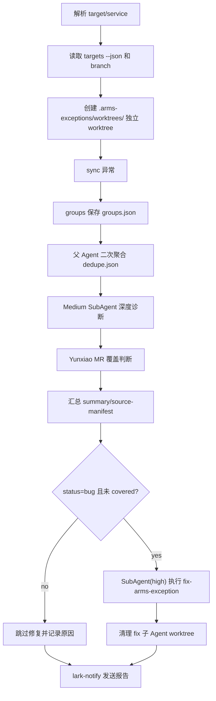

# ARMS 异常分诊

## Overview

这个 skill 编排 `arms-exceptions-explorer`、`yunxiao-mr`、`fix-arms-exception` 和 `lark-notify`。目标是 CI/Agent 自动执行完整链路；除非调用方显式要求 triage-only，否则不要在修复前等待用户干预。

一次只处理一个 target；service 输入必须能唯一反查到所属 target。缺配置、缺权限或需要人工判断时，记录为 blocked/needs_human 并通知，不进入交互式追问。

## Required Scope

先在宿主项目根目录执行：

```bash
python3 skills/arms-exceptions-explorer/scripts/cli.py doctor
python3 skills/arms-exceptions-explorer/scripts/cli.py targets --json
```

规则：

- 输入 `target` 时，处理该 target 下所有 services。
- 输入 `service` 时，从 `targets --json` 唯一定位所属 target；不能唯一定位就停止并要求改传 target。
- target 必须配置 `branch`；没有 branch 时停止，不猜 `main/master/dev`。
- 不要静默跨多个 target。

## Artifacts

每次运行在宿主项目写本地产物：

```text
.arms-exceptions/triage/<YYYYMMDDTHHMMSS>-<target-or-service>/
  summary.md
  source-manifest.md
  groups.json
  dedupe.json
  existing-mrs.json
  subagents/
    diagnose-<stable-slug>.md
    fix-<stable-slug>.md
```

确认宿主项目 `.gitignore` 包含：

```text
.arms-exceptions/triage/
```

`source-manifest.md` 必须记录 sources、产物、关键决策、验证证据和未决风险。

所有 triage/fix worktree 统一放在宿主项目：

```text
.arms-exceptions/worktrees/
```

诊断模板、MR 匹配细节和 summary 建议见 `references/workflow.md`。

## Workflow



1. 解析 target/service，记录 target、services、branch、窗口。
2. 优先从 target.branch 创建或切换到 `.arms-exceptions/worktrees/<run-id>/` 独立 worktree，避免干扰用户当前工作区。
3. 用 `arms-exceptions-explorer sync --target <target> --json` 或 `sync --service <service> --json` 同步异常。
4. 用 `groups --target <target> --json` 或 `groups --service <service> --json` 拉取本地聚合组并保存到 `groups.json`。

5. 父 Agent 做二次聚合、去重和初筛，保存 `dedupe.json`。`group_id` 只作为本次运行内定位，不能作为跨运行强证据。
6. 对保留的异常组调用 `show <group_id> --json` 获取详情，并派发 medium-effort Sub Agent 深度诊断。
7. 使用 `yunxiao-mr list --state opened --json` 和必要的 merged/search 查询，判断是否已有 MR 覆盖。
8. 汇总诊断结果到 `summary.md`。
9. 对 `status=bug` 且未被强证据 MR 覆盖的项，派发 SubAgent(high) 执行 `fix-arms-exception`。
10. 父 Agent 收集 fix 子 Agent 的 MR/失败结果后，清理对应 `.arms-exceptions/worktrees/fix-*` worktree，并在 `source-manifest.md` 记录清理结果；清理失败时保留路径和原因。
11. 调用 `lark-notify send --title "ARMS 异常分诊: <target>" --body-file .arms-exceptions/triage/<run-id>/summary.md --format card` 发送报告。

## Rules

- Sub Agent 并发不固定；父 Agent 自行决定并记录调度理由。
- fix 子 Agent 的 worktree 必须由父 Agent 在汇总后清理；不得清理用户当前工作区或非 `.arms-exceptions/worktrees/` 路径。
- 详细异常内容可以写进报告和飞书通知，但永远不要包含凭证、Authorization header、AccessKey、Token、SecurityToken、签名 URL 或 OAuth code。
- 默认面向 CI 自动完整执行；无法继续时写入 blocked/needs_human、发送通知并以失败状态退出。
- 深度诊断、MR 覆盖判断和 summary 格式不足时读取 `references/workflow.md`。

## References

更多诊断模板、MR 匹配和 summary 细节见 `references/workflow.md`。
